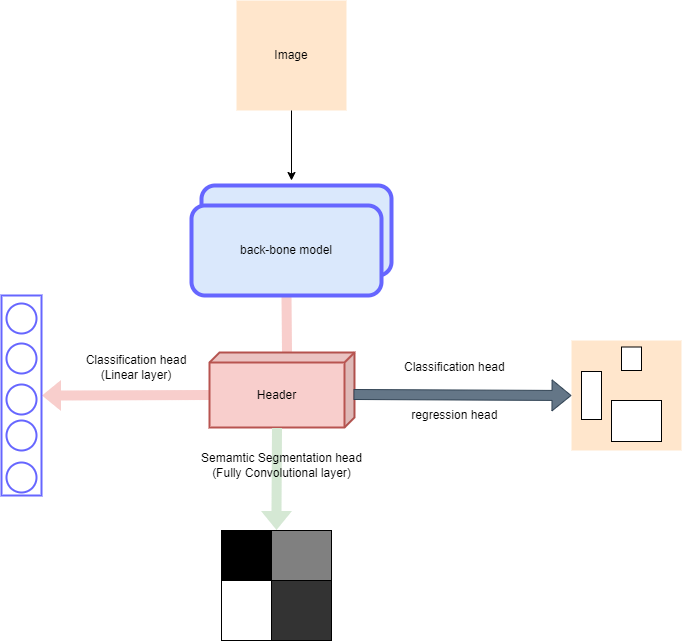

# Pytorch-pretrained-models (AISeed)
The project aims to provide a framework for efficiently utilizing pre-trained models in PyTorch using the PyTorch Lightning library. Additionally, it incorporates the Neptune logger. This project serves two primary purposes: to facilitate rapid testing of new datasets and to act as a framework for downstream tasks by leveraging pre-trained models.

# Features
- Integration of pre-trained models into PyTorch Lightning
- Support for seamless experimentation with new datasets
- Logging and monitoring capabilities through Neptune logger
- Simplified framework for downstream tasks with pre-trained models

# Installation
## prequisite
- Python=3.9
- CUDA: 11.2/11.3
- Pytorch framwork: 1.12.1, pytorch-lightning
- Others: numpy, opencv, scipy
- dashboard: neptune ai (for training), gradio (for testing)
## Environments Settings
1. Install [Anaconda](https://www.anaconda.com/)
- create a new environment:
```
conda create --name=ENV_NAME python=3.9
conda activate ENV_NAME
```
2. Clone the repository:
```bash
git clone https://github.com/Ka0Ri/Pytorch-pretrained-models.git
```
3. Install dependencies: 
```bash
conda install pytorch==1.12.1 torchvision==0.13.1 cudatoolkit=11.3 -c pytorch

pip install -r requirements.txt
```
## Docker (Linux only)
1. [Install Docker](https://docs.docker.com/engine/install/ubuntu/)
- Download Docker
```bash
curl -fsSL https://download.docker.com/linux/ubuntu/gpg | sudo apt-key add -
sudo add-apt-repository \
"deb [arch=amd64] https://download.docker.com/linux/ubuntu \
$(lsb_release -cs) stable"
sudo apt-get update
sudo apt-get install docker-ce docker-ce-cli containerd.io
```
```bash
sudo usermod -aG docker $USER
```
- Install CUDA container runtime
```bash
curl -s -L https://nvidia.github.io/nvidia-container-runtime/gpgkey | sudo apt-key add -
distribution=$(. /etc/os-release;echo $ID$VERSION_ID)
curl -s -L https://nvidia.github.io/nvidia-container-runtime/$distribution/nvidia-container-runtime.list |\
sudo tee /etc/apt/sources.list.d/nvidia-container-runtime.list
sudo apt-get update
sudo apt-get install nvidia-container-runtime
```
- Restart Docker
```bash
sudo systemctl stop docker
sudo systemctl start docker
```
2. Pull the Image
```bash
docker build --tag pytorch-finetune:runtime --file Dockerfile .
```
3. Check docker environment
```bash
docker run --rm -it --init \
  --gpus=all \
  pytorch-finetune:runtime nvidia-smi
```
#

It facilitates three distinct modes of operation: (1) inference utilizing the complete model, (2) fine-tuning with a particular class within the standard layers. Table 1 presents comprehensive information regarding the supported models, while the subsequent section outlines the configurations to be provided.
- `Classifier.py`: [WrappingClassifier](Modules/Classifier.py#L59) Wrapping Head for classification task.
- `Detector.py`: [WrappingDetector](Modules/Detector.py#L30) Wrapping Head for object detection task.
- `Segment.py`: [WrappingSegment](Modules/Segment.py#L22) Wrapping Head for semantic segmentation task.



<table>
<tr>
<td colspan=1>
    Table 1. Supported models
</td>

| Name  | Description |Metrics | Params |
| ------------- | ------------- | ------------- | ------------- |
| `Classification` | Model| Accuracy | milions |
| resnet | [ResNet](https://arxiv.org/abs/1512.03385)  |-  | s: 11.5, m: 28.0, l: 62.6 |
| efficientnet | [Efficient Net v2](https://arxiv.org/abs/2104.00298)  | -  | s: 21.9, m: 54.6, l: 118|
| vgg | [Very Deep CNN](https://arxiv.org/abs/1409.1556)  | -  | s: 9.5, m: 9.7, l: 20.3 |
| densenet | [DenseNet](https://arxiv.org/abs/1608.06993)  |  - | s: 8.1, m: 31.7, l: 22.0|
| wide_resnet | [Wide ResNet](https://arxiv.org/abs/1605.07146)  | -  | s: 71.3, m: 129|
| inception | [Inception v3](https://arxiv.org/abs/1512.00567)  |  - | 29.6 |
| mobilenet | [Mobile Net v3](https://arxiv.org/abs/1905.02244)  | -  | s: 1.3, m:, l: 4.0|
| shufflenet | [Shuffle Net](https://arxiv.org/abs/1807.11164)  |  - | s: 1.5, m: 2.4, l: 9.8 |
| convnext | [ConvNext](https://arxiv.org/abs/2201.03545)  | -  | s: 28.5, m: 88.7, l: 198 |
| resnext | [ResNext](https://arxiv.org/abs/1611.05431v2)  |  - | s: 27.5, m: 91.2, l: 85.9 |
| vit | [Vision Transformer](https://arxiv.org/abs/2010.11929)  |  - | s: 86.4, m: 304, l: |
| swin | [Swin Transformer](https://arxiv.org/abs/2103.14030)  |  - | s: 28.2, m: 49.5, l: 87.9|
| `Detection` | Model| mAP | milions |
| retinanet | [Retina Net](https://arxiv.org/abs/1708.02002)  |  - | m: 32.2, l: 36.4 |
| ssd | [Single Shot Detection](https://arxiv.org/abs/1512.02325)  |  - | s: 3.8, m: 25.4 |
| fasterrcnn |[Faster Region Proposlal CNN](https://arxiv.org/abs/1506.01497)  | -  | s: 20.0, m: 42.4 |
| `Segmentation` | Model| dice | milions |
| fcn | [Fully CNN](https://arxiv.org/abs/1411.4038)  |  - | m: 28.0, l: 47.0 |
| deeplab | [Atrous Convolution](https://arxiv.org/abs/1706.05587) | -  | m: 23.5, l: 87.9 |
| maskrcnn | [Masked RCNN](https://arxiv.org/abs/1703.06870) | - | s: 39.5 |
#
## Training Interface
Examples of training Wrapping Network can be found in [ultis.py](Modules/ultis.py) and train file [train.py](train.py), we config hyper-parameters in [config.yml](Modules/new-config.yml) file

- `ultis.py`: Three pre-defined datasets have been established, each serving as a demonstration for the training-testing process of a specific task, [CIFAR10](Modules/ultis.py) for classification, [Lung CT-scan](Modules/ultis.py) for object detection, and [PennFudan](Modules/ultis.py) for binary object segmentation.
- Trainning `train.py`: Our main module is [Model](Modules/train.py) that based on [pytorch-lightning](https://lightning.ai/pages/open-source/) and logged by [neptune-ai](https://neptune.ai/). As shown in the Figure above, we logged hyperparameters, metrics, and results from each run.


1. Import the necessary modules:
```python
import yaml
from pytorch_lightning.loggers import NeptuneLogger
from Modules.train import DataModule, Model, get_trainer
```
1. Load Config file and Neptune logging repository:

```Python
with open(args.config_file, 'r') as stream:
        PARAMS = yaml.safe_load(stream)
        print(PARAMS)

neptune_logger = NeptuneLogger(
        api_key="YOUR_API_KEY",
        project ="YOUR_PROJECT_NAME",
        log_model_checkpoints=False,
    )

neptune_logger.log_hyperparams(params=PARAMS)
```
3. Load Data
```Python
# add key and new data class as followed, in Train.py DataModule class
self.data_class = {
   "CIFAR10": CIFAR10read,
   "LungCT-Scan": LungCTscan,
   "Dubai": DubaiAerialread,
   "PennFudan": PennFudanDataset,

   # New dataset
   "New Dataset": NeWDatasetClass
}
```
```Python
data = DataModule(PARAMS['dataset_settings'], PARAMS['training_settings'], [None, None])
```
4. Fine tune and evaluate moodel
```Python
model = Model(PARAMS=PARAMS)
trainer = get_trainer(PARAMS['training_settings'], neptune_logger)
# train
trainer.fit(model, data)
# test
trainer.test(model, data)
```
5. Run training in environment
```bash
python Modules/train.py -c CONFIG_FILE
```
6. Run training by Docker
```bash
docker run --rm -it --init \
  --gpus=all \
  --ipc=host \
  --volume="$PWD:/app" \
  pytorch-finetune:runtime python Modules/train.py
```
#

## Testing Interface
We deploy (demo) our model using [Gradio](https://gradio.app/), which supports to visualize results from 3 tasks: classification, detection, and segmentation, depending on the selected model.


1. Create a folder named `models` and save all checkpoints inside it. 
2. Run app
- by environment: 
```bash
python Modules/app.py
```
- by Docker:
```bash
docker run --rm -it --init \
  --gpus=all \
  --ipc=host \
  --volume="$PWD:/app" \
  -p 7860:7860 \
  pytorch-finetune:runtime python Modules/app.py
```
#
## Configuration (Config file)
The configurations, a [config.yaml](Modules/config.yaml), encompassing the model architecture and training settings, as well as dataset settings. The "config.yaml" file follows a structured format, consisting of a list of dictionaries. Each dictionary within the list represents a distinct configuration and saves specific configuration parameters.

<table>
<tr>
<td colspan=1>
    Table 2. Configuration
</td>

| Parameters  | Description |Scope | Value |
| ------------- | ------------- | ------------- | ------------- |
| `logger` | neptune account |  |  |
| project | your project | logger |str  |
| api_key | your account token | logger |str  |
| tags | Runtime Tags | logger |[str]  |
| task | task of experiment |  | str: "classification", "detection", "segmentation" |
| `Model` |
| name | Model's name  | architect_settings  | string |
| name | Pretrained model  | architect_settings/backbone  | string: "name"-"s/m/l" |
| is_full | If True, use full model  | architect_settings/backbone  | Bool |
| is_pretrained |  pretrained weights  | architect_settings/backbone  | Bool |
| is_freeze | Freeze weights  | architect_settings/backbone  | Bool |
| n_cls | num classes  | architect_settings | int |
| `Dataset` |
| name | Dataset name  | dataset_settings | string: "LungCT-Scan", "CIFAR10", "PennFudan" |
| path | path to dataset  | dataset_settings  | string |
| img_size | size of image to model  | dataset_settings  | int |
| `Training` |
| gpu_ids | list of gpus used  | training_settings  | list: [0] |
| n_gpu | num gpus  | training_settings  | int |
| img_size | size of image to model  | training_settings  | int |
| loss | loss function  | training_settings  | str: "ce" (classification/segmentation), "dice", "mse", "none"(detection) |
| ckpt_path | path to check-points  | training_settings  | str |
| n_epoch | num epoch  | training_settings  | int |
| n_batch | batch size  | training_settings  | int |
| num_workers | num workers to dataloader | training_settings  | int |
| optimizer | optimizer | training_settings  | str: "adam", "sgd" |
| lr_scheduler | learning rate scheduler | training_settings  | str: "step", "multistep", "reduce_on_plateau" |
| early_stopping | early stopping | training_settings  | bool |
| lr | learning rate | training_settings  | float|
| lr_step | learning rate step for decay| training_settings  | int|
| lr_decay | learning rate decay rate | training_settings  | float|
| momentum | momentum for optimizer | training_settings  | float|
| weight_decay | weight decay for "sgd" | training_settings  | float|
</tr>
The understanding of the functioning of the configuration file is best obtained by referring to the actual "config.yaml" file. It is crucial to acknowledge that the module's flexibility is maintained by avoiding excessive hard coding of parameters. This is because fine-tuning and optimizing the parameters play a vital role in the development process. As part of our ongoing efforts to enhance the performance of the module, we anticipate making further refinements to the configurations. Consequently, it is likely that the config file will be subject to future updates to reflect these optimizations.

# Contributing
Contributions are welcome! If you find any issues or have suggestions for improvements, please open an issue or submit a pull request.

When contributing to this project, please adhere to the following guidelines:

- Fork the repository and create a branch for your feature or bug fix.
- Ensure that your code is well-documented and follows the project's coding conventions.
- Write clear commit messages and provide a detailed description of your changes.
- Ensure that your code passes all existing tests and write new tests when applicable.
# License
This project is licensed under the MIT License.

# Acknowledgments
- AISeed Inc for supporting developers.
- The Pytroch/ PyTorch Lightning community for providing a powerful and flexible deep learning framework.
- The Neptune Ai community for providing a professional logger.
# Contact
For any questions or inquiries, please contact dtvu1707@gmail.com
